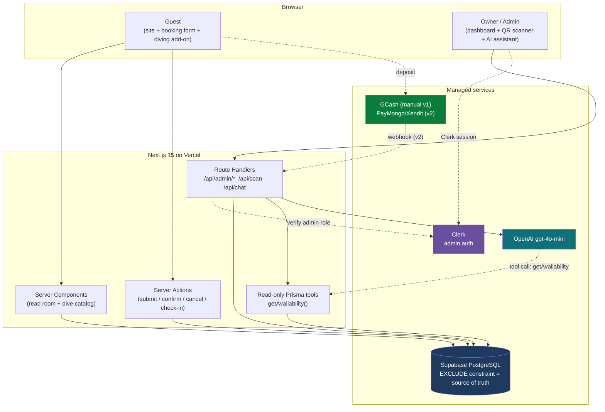
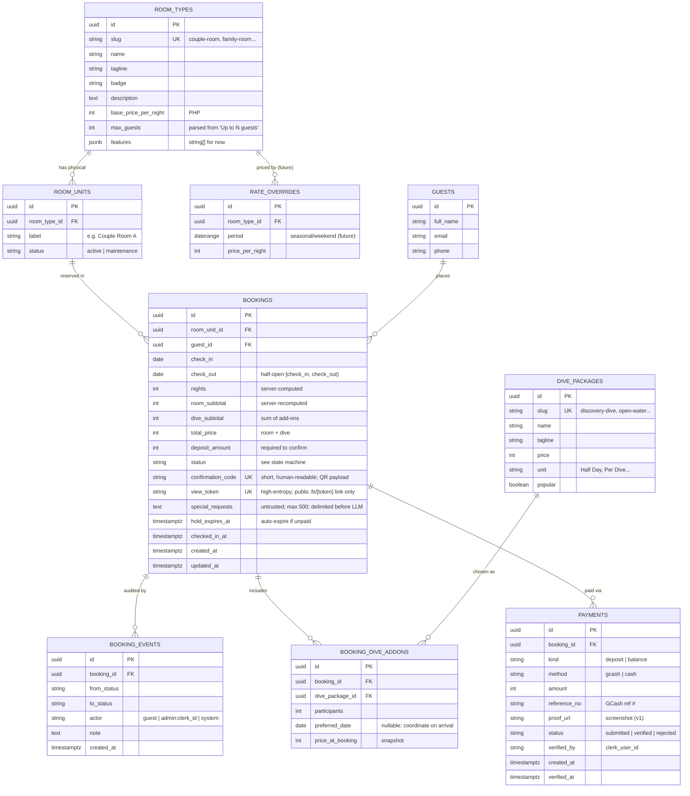
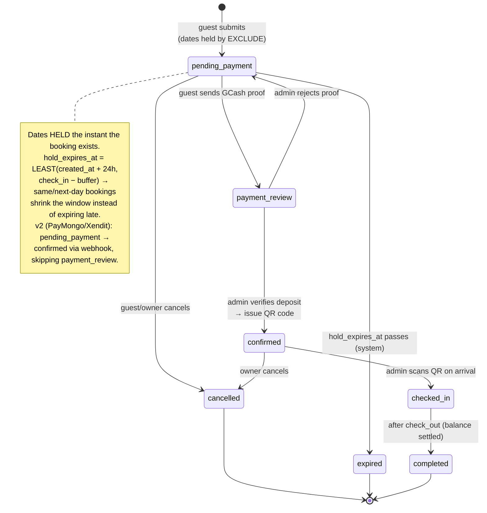
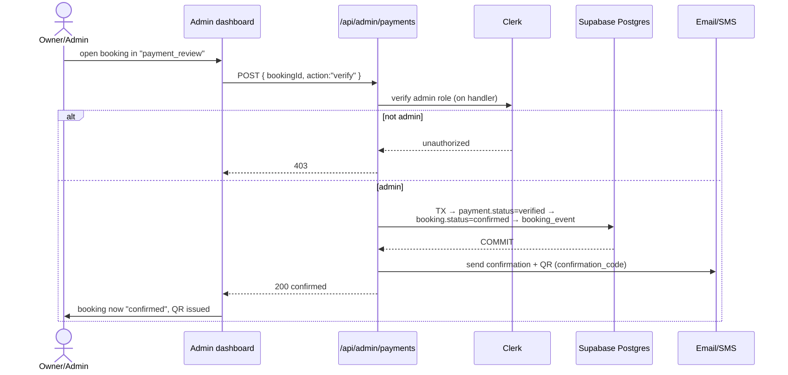
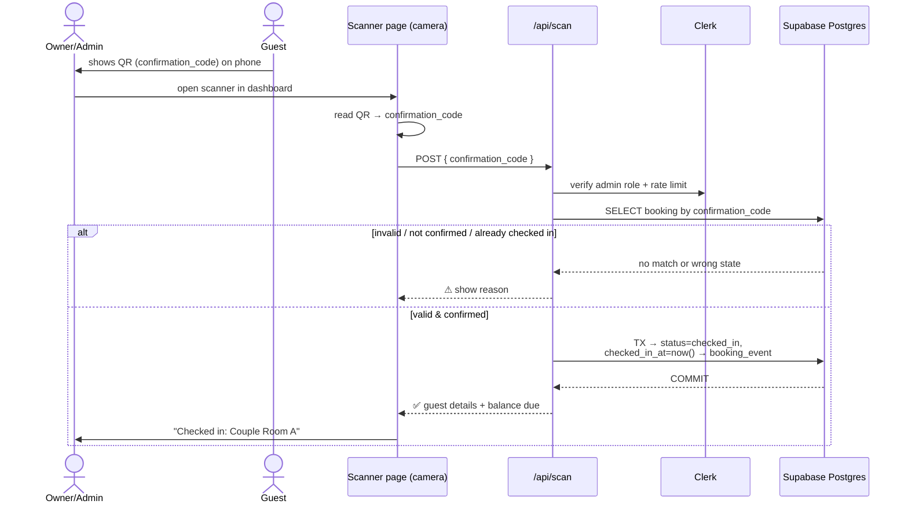
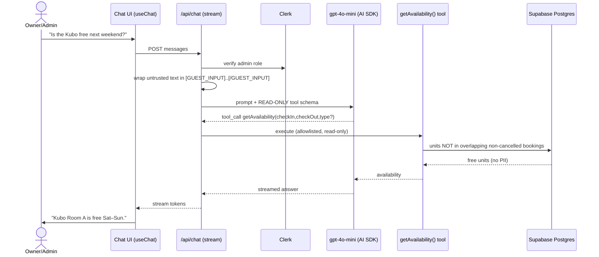
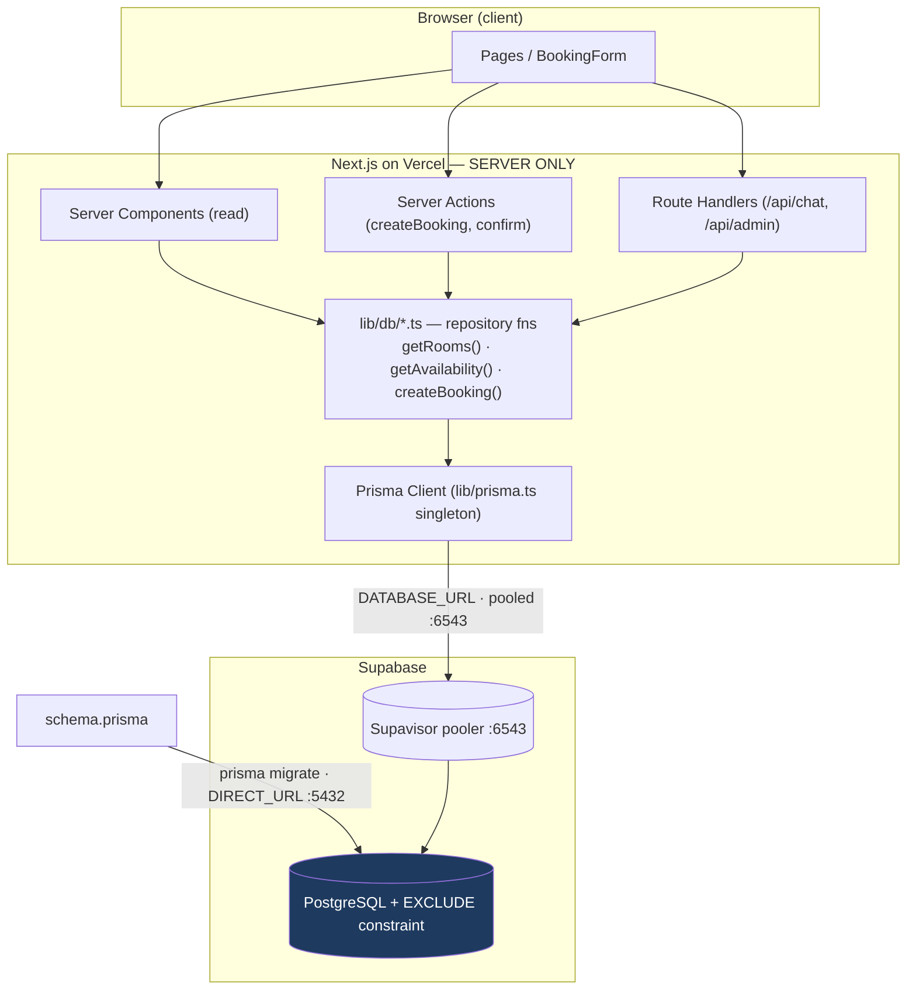
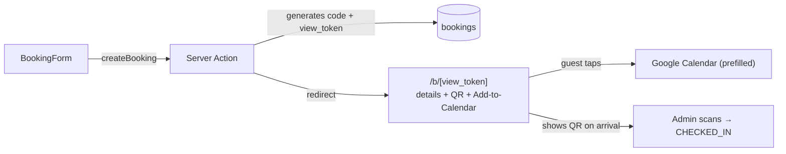
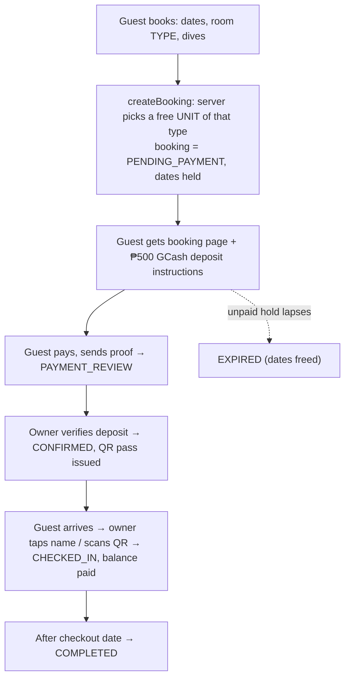

# System Design — BiNuKBoK VieW PoiNT ReSoRT backend

> Drafted by Bryl (Noxa's Dev Team) for owner validation.
> Status: **PROPOSAL v2 — incorporates owner answers (QR check-in, diving add-ons, deposit + hold). Validate each diagram before code.**
> Stack (locked in CLAUDE.md): Next.js 15 (App Router) · Supabase PostgreSQL · Prisma · Vercel · Clerk (admin auth) · OpenAI `gpt-4o-mini` via Vercel AI SDK.

---

## 0. What changed in v2 (from your answers)

| Topic | Your decision | Design impact |
|-------|---------------|---------------|
| Room units | Asked why it matters → **model units regardless, seed real counts** | `room_units` stays; counts are seed data |
| Acceptance | **QR code that the admin scans** to accept/check in | `confirmation_code` + QR; new "check-in" state + scan flow (Diagram 7) |
| Diving | **Bookable as an add-on inside the booking form** (checkbox + dropdown of all courses; pre-selected from a dive page) | `booking_dive_addons` join table; `/book?dive=<slug>` deep link |
| Payments | **Deposit + hold policy** | `payments` table + `hold_expires_at`; deposit-to-confirm state machine (Diagram 4) |

---

## 1. Design decisions (research-backed)

| # | Decision | Why (and what we rejected) |
|---|----------|----------------------------|
| D1 | **Reserve a physical unit + Postgres `EXCLUDE` constraint** | Big-hotel designs use a per-date *inventory counter* with locking — overkill and error-prone at your scale. A per-unit exclusion constraint makes double-booking *structurally impossible* in the DB with zero locking code. |
| D2 | **`room_types` (catalog/pricing) ≠ `room_units` (physical bookable things)** | The unit count = max bookings you can accept for the same dates. Model units even if it's 1 of each today; seed the real counts to avoid a painful migration later. |
| D3 | **Half-open date ranges `[)`** | Checkout on the 12th + check-in on the 12th must **not** collide. |
| D4 | **Partial constraint: `WHERE status NOT IN ('cancelled','expired')`** | Cancelled/expired holds free the dates back automatically without deleting history. |
| D5 | **Deposit-to-confirm state machine with hold expiry** (Diagram 4) | Dates are held the instant a booking is created; an unpaid hold auto-expires and releases. Confirmation requires a verified GCash deposit. |
| D6 | **QR confirmation code for check-in** | On confirmation, issue a high-entropy **opaque** `confirmation_code` rendered as a QR. Admin scans it on arrival to check the guest in. Never encode a raw/guessable booking id. |
| D7 | **Diving is an add-on to a stay** | A booking can include one or more dive experiences via `booking_dive_addons`. Standalone dive-only booking (no room) is a future option — flagged in §8. |
| D8 | **`booking_events` audit table** | Every status change (who/when) for the admin trail. |
| D9 | **`EXCLUDE` constraint as raw-SQL Prisma migration** | Prisma can't express exclusion constraints natively (issue #17514). Raw SQL; run migrations on the **direct** connection (`directUrl`, port 5432), not the pooler. |
| D10 | **Server recomputes price + availability; all dates `Asia/Manila`** | Client never trusted. The Server Action recomputes nights, room + dive totals, and re-checks availability inside the transaction. |

**Payment rollout:** v1 = **manual GCash** (guest sends reference + screenshot, admin verifies). v2 = **PayMongo or Xendit** (both support GCash in the Philippines) for instant auto-confirm via webhook. The data model below supports both — only the verification step changes.

### Locked parameters (v2)

| Parameter | Value | Notes |
|-----------|-------|-------|
| Deposit | **₱500 fixed** | Same flat reservation fee for every booking |
| Deposit window (hold) | **24h after booking, capped by check-in** | `hold_expires_at = LEAST(created_at + 24h, check_in − buffer)` so same-/next-day bookings don't expire *after* arrival |
| Advance booking horizon | **up to 12 months ahead** | The 24h deposit rule still applies regardless of how far out the stay is |
| Diving | **add-on to a room stay only** | No dive-only bookings in v1 |
| Notifications | **Email only (Resend)** | Confirmation + QR sent by email |
| Payment (v1) | **Manual GCash** | Guest sends ref # + screenshot; admin verifies |

**Deliberately NOT building now:** no inventory microservice, no Redis counters, no separate booking/inventory services, no payment gateway in v1, no SMS provider.

---

## 2. System context (architecture)



---

## 3. ERD — data model



**The constraint that makes it all work** (raw-SQL migration):

```sql
CREATE EXTENSION IF NOT EXISTS btree_gist;

ALTER TABLE bookings
  ADD CONSTRAINT bookings_no_overlap
  EXCLUDE USING gist (
    room_unit_id WITH =,
    daterange(check_in, check_out, '[)') WITH &&
  )
  WHERE (status NOT IN ('cancelled', 'expired'));
```

---

## 4. Booking lifecycle (state machine, with deposit + hold + QR)



---

## 5. Guest booking submission — with diving add-ons (sequence)

```mermaid
sequenceDiagram
    actor G as Guest
    participant F as BookingForm (client)
    participant A as Server Action
    participant Z as Zod (server schema)
    participant DB as Supabase Postgres

    Note over G,F: arrived via /book?dive=open-water → dive pre-selected
    G->>F: dates, room, guests, "Add Diving Experience" + course(s)
    F->>F: client validation + live total (UX only)
    F->>A: submit(BookingInput + diveAddons[])
    A->>Z: validate (authoritative); special_requests max 500
    alt invalid
        Z-->>A: error
        A-->>F: { ok:false, errors }
    else valid
        A->>A: recompute nights, room subtotal,<br/>dive subtotal, deposit (Asia/Manila)
        A->>DB: BEGIN TX → upsert guest →<br/>INSERT booking (status=pending_payment,<br/>hold_expires_at, confirmation_code) →<br/>INSERT dive add-ons → INSERT booking_event
        alt dates overlap
            DB-->>A: 23P01 exclusion_violation
            A-->>F: { ok:false, message:"Those dates are taken" }
        else free
            DB-->>A: COMMIT (booking id + GCash instructions)
            A-->>F: { ok:true, bookingId, depositAmount, payTo }
            F->>G: "Reserved! Pay ₱X deposit via GCash to confirm."
        end
    end
```

---

## 6. Admin confirm (verify deposit) — sequence



---

## 7. QR check-in on arrival — sequence



---

## 8. AI chatbot — read-only availability assistant (sequence)



---

## 9. Decisions log

**Locked:** deposit ₱500 fixed · hold 24h (capped by check-in) · advance booking ≤12 months · diving = add-on only · email-only (Resend) · manual GCash (v1).

**Still needed before seeding the DB:**

1. **Unit counts** — how many physical units of each: Couple / Family / Kubo / Camping Tent? (default: 1 each, change anytime via seed)
2. **GCash receiver** — the GCash name + number guests pay the ₱500 deposit to (shown on the confirmation screen + email).
3. **Diving details** — confirm we capture *participants + preferred date* per dive add-on. (assumed yes)

---

## 10. Data access architecture (Prisma + Supabase)



**Pattern:** layered architecture with a Repository seam. Supabase = the managed Postgres database; Prisma = the only thing that talks to it, server-side. Components/actions call `lib/db/*` functions (the seam that replaces today's hardcoded `lib/data.ts`), which call the Prisma client singleton.

**Connection wiring (two strings):** `DATABASE_URL` = pooled (Supavisor :6543) for runtime; `DIRECT_URL` = direct (:5432) for `prisma migrate` only. **Prisma bypasses RLS** (privileged role) — authorization lives in server code (Clerk + Server Actions); keep RLS enabled as a defense-in-depth backstop.

---

## 11. Implementation status

✅ **Live & verified against Supabase (`binukbok-viewpoint`, ap-southeast-1):**
- `prisma/schema.prisma` — all 8 tables/enums from the ERD, snake_case columns (`@map`). Prisma **6.x** (v7 deferred — needs `prisma.config.ts` + driver adapters, off the documented Supabase path)
- Migrations applied: `…_init` (tables) + `…_security_setup` (RLS on all 8 tables + the `EXCLUDE` constraint)
- **Double-booking constraint behaviorally verified** (`scripts/verify-db.ts`): overlap rejected, adjacent (half-open) allowed ✅
- Seeded: 4 room types, **4 room units (1 each — placeholder counts)**, 4 dive packages
- `lib/prisma.ts` (client singleton) · `lib/schemas.ts` (Zod contracts) · `prisma/seed.ts`
- `@prisma/client` `prisma` `zod` `tsx` installed; `prisma generate` + `tsc --noEmit` pass
- Hygiene: stray `package-lock.json` removed and gitignored; `db:*` scripts in `package.json`
- **Post-booking page live & verified** (`app/b/[token]`): `view_token` migration applied, QR + Add-to-Calendar, security headers, invalid-token safe — confirmed via live fetch (see §12)
- **`createBooking` + `getAvailability` live & verified** (`lib/db/bookings.ts`, `app/book/actions.ts`): book-by-**type** with automatic unit assignment, server-side pricing + validation (past-date, capacity, dive packages), `EXCLUDE`-guarded races, returns the `/b/[token]` link — 7/7 checks (`scripts/test-create-booking.ts`)
- **Booking form wired end-to-end & browser-verified**: `/book` reads the catalog from the DB (`lib/db/catalog.ts`), supports `?dive=<slug>` pre-select and the "Add Diving Experience" UI → `createBookingAction` → redirects to `/b/[token]`. Pending bookings show a gray GCash-deposit placeholder; the QR appears after `CONFIRMED`. Verified by a real form submission in the browser.

⏭️ **Next:**
1. Admin dashboard (Clerk): deposit verification → `CONFIRMED`; "today's arrivals" list → tap/scan → `CHECKED_IN`
2. Real GCash receiver details + confirmed unit counts (currently a gray placeholder / 1 each)
3. Hardening: rate-limit `/b/*` + scan endpoint; QR in the confirmation email (Resend); auto-expire unpaid holds (cron)
4. Phase 3 (AI chatbot)

---

## 12. Post-booking page + QR (implemented)

A new booking gets a `confirmation_code` (short, human-readable — the QR payload) and a `view_token` (high-entropy — the public link). The guest is sent to `/b/[view_token]`, which shows their booking + QR + an "Add to Google Calendar" button. On arrival they show the QR and the admin scans it to flip the booking to `CHECKED_IN` ("arrived").



**Schema delta:** one new column — `bookings.view_token` (UNIQUE, nullable). No new tables.

**Security (implemented):** `view_token` is a separate 32-byte secret (≠ `confirmation_code`); the public page shows only name / room / dates / code / QR (never email, phone, price, or special_requests); `Cache-Control: no-store` + `X-Robots-Tag: noindex` + `Referrer-Policy: no-referrer` on `/b/*`; the link is invalid after checkout + 24h and on cancellation.

**Still to harden:** rate-limit `/b/*` (scraping) and the admin scan endpoint; also deliver the QR in the confirmation email (not only via the calendar link).

---

## 13. Booking flow (end-to-end, validated)

The complete guest → arrival → checkout flow. Validated as best practice for a deposit-based resort. Manual GCash verification (steps 2–3) is the deliberate **v1** simplification — a PayMongo/Xendit webhook can auto-confirm later **without changing the flow**.



**Unit assignment:** the guest books a room *type*; the server assigns an available physical *unit* of that type for the dates (the `EXCLUDE` constraint guards against races). "Fully booked" = no free unit of that type.

**Check-in is owner-controlled** (privileged action + the balance is collected then): the admin marks "arrived" by **tapping** the guest in a searchable "today's arrivals" list, or **scanning** their QR as a shortcut. Guests never mutate their own status. Idempotent; only `CONFIRMED` bookings can be marked arrived. *(A camera scanner is a later enhancement — the tap-the-list path covers 100% of check-ins.)*

**Open edge cases (decide later):** same-day walk-ins (owner creates a booking on the spot) and no-shows (auto-flag vs. leave to owner).
